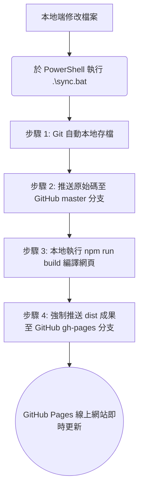

# 建築與空間設計作品集網站：架構與發展脈絡

本文件旨在完整記錄 Casper Lee 個人作品集網站的系統架構、架設流程、維護指南以及在開發過程中遇到的挑戰與解決方案，以便未來任何開發者或您自己在維護時，能快速且完整地了解此網站。

---

## 🌐 系統技術簡介
本作品集網站採用現代網頁開發技術建構，著重於網頁載入速度、極簡視覺美學以及內容維護的便利性：
*   **前端框架**：[Astro (v6.4.6)](https://astro.build/) —— 專為內容導向型網站設計的現代框架，預設會將網頁編譯成純靜態 HTML，確保極速的載入體驗。
*   **樣式設計**：[Tailwind CSS (v4.3.0)](https://tailwindcss.com/) —— 實用優先（Utility-First）的 CSS 框架，用於實現精確、極簡且具動態效果的空間美學。
*   **資料儲存**：**Markdown 檔案** 與 **JSON 設定檔** —— 採用無資料庫（Database-less）架構，網頁內容皆由本地文字檔案動態解析生成。
*   **版本控制與部署**：**Git + GitHub Pages** —— 使用版本控制追蹤所有變更，並利用自動化腳本一鍵編譯部署。

---

## 📂 資料夾結構與檔案功能說明

專案的核心檔案結構如下，每個檔案與目錄皆扮演特定角色：

| 路徑/檔案 | 功能類型 | 說明 |
| :--- | :--- | :--- |
| **`public/`** | 靜態資源 | 存放不需編譯的檔案。包含網站 Favicon、CV 履歷 PDF、以及作品相片。 |
| ├── `public/my_cv.pdf` | 履歷檔案 | Casper 的最新版個人簡歷 PDF 檔。 |
| └── `public/images/` | 作品照片庫 | 分門別類存放各作品的渲染圖、草圖與過程照片（如 `project-01/` 等）。 |
| **`src/`** | 網頁原始碼 | 網站所有邏輯與排版原始碼都在此資料夾內。 |
| ├── `src/config.json` | **全站設定檔** | 存放個人姓名、LOGO、大標題、聯絡資訊與社群連結，一改全改。 |
| ├── `src/content.config.ts` | 資料欄位設定 | 定義作品集 Markdown 內的前言格式欄位（例如作品年份、分類）。 |
| ├── `src/content/projects/` | **作品集資料庫** | 存放各作品的 Markdown 說明檔。每個 `.md` 檔代表一個作品項目。 |
| ├── `src/layouts/` | 網頁佈局範本 | `Layout.astro` 內含 HTML 基礎結構、SEO 設定、Navbar 導覽列與 Footer 頁尾。 |
| ├── `src/pages/` | 網頁路由頁面 | Astro 會自動將此處的檔案映射為網址路徑：<br>• `index.astro` ➔ 首頁 (幻燈片輪播)<br>• `about.astro` ➔ 關於我<br>• `projects/index.astro` ➔ 作品總覽頁 (分類篩選)<br>• `projects/[slug].astro` ➔ 作品詳細頁 (動態路由) |
| └── `src/styles/` | 基礎樣式 | `global.css` 用於載入 Tailwind CSS 的基礎設定。 |
| **`sync.bat`** | 自動化腳本 | 專為 Windows 設計的一鍵同步工具，雙擊即可同時備份原始碼與部署網頁。 |
| **`astro.config.mjs`** | 框架設定 | Astro 專案設定檔，整合並載入 Tailwind CSS 工具。 |
| **`package.json`** | 套件管理 | 記載專案相依套件與啟動指令（如 `npm run dev` 啟動預覽）。 |

---

## 🚀 網站維護與內容更新指南

當您需要累積新作品或修改個人資料時，請遵循以下步驟進行：

### 1. 更新個人資訊與簡歷
*   **自介與聯絡方式**：直接修改 [src/config.json](file:///c:/Users/User/OneDrive/Desktop/桌面/260612architectur-portfolio/src/config.json) 中的對應值，網站隨即更新。
*   **更換 CV/履歷 PDF**：將您的新 PDF 檔重新命名為 `my_cv.pdf`，直接覆蓋替換掉 `public/my_cv.pdf` 即可。

### 2. 新增作品項目 (Project)
1.  **準備相片**：
    *   在 `public/images/` 下為新作品建立子資料夾（如 `project-05`）。
    *   將渲染圖、手繪草圖放進去。**注意**：請確保圖片是真正的 `.jpg`、`.png` 或 `.webp` 格式，且檔名使用英文或數字。
2.  **建立 Markdown 檔案**：
    *   在 `src/content/projects/` 下新增一個 `.md` 檔（例如 `05-urban-oasis.md`）。
    *   在最上方加入 Frontmatter 元數據設定欄位（範例如下）：

```markdown
---
title: "都市綠洲計畫"
year: 2026
category: "School Project"              # 僅限以下四種："School Project", "Internship Project", "Other Experience", "Sketch & Idea"
cover: "/images/project-05/cover.jpg"   # 封面大圖路徑
images:                                 # 內頁照片輪播清單，必須是完整路徑
  - "/images/project-05/cover.jpg"
  - "/images/project-05/process-01.jpg"
  - "/images/project-05/sketch.png"
featured: true                          # 設為 true 才會出現在首頁的大圖幻燈片
---

這裡輸入該專案的詳細文字理念、基地分析、所用工具及設計說明...
```

---

## 🔄 GitHub 同步與自動化部署機制

為了讓不熟悉複雜 Git 指令的使用者也能輕鬆維護網站，專案導入了 **Dual-Branching（雙分支）** 的自動化部署設計：



### `sync.bat` 自動化流程：
1.  **自動提交原始碼**：將本地所有修改（如新增的圖片、修改的 `.md` 檔）記錄成 commit，並上傳到 GitHub 的 `master` 分支儲存庫，作為永久的雲端原始碼備份。
2.  **本地編譯**：在背景執行 `npm run build`，Astro 會將所有的 Markdown、Astro 頁面編譯為網頁瀏覽器認得的純 HTML/CSS。
3.  **強制發布**：在 `dist/` 資料夾中初始化一個乾淨的臨時 Git 倉庫，並將編譯完成的網頁強行推送（Force Push）到 GitHub 的 `gh-pages` 分支。由於該分支專用於提供靜態網頁服務，GitHub Pages 將在幾秒鐘內自動將變更反映至您的公開網址上。

---

## 🛠️ 開發過程中的問題記錄與解決方案 (Troubleshooting)

在專案架設過程中，我們共同解決了以下幾項關鍵技術難題：

### 1. 動態詳情頁面的圖片絕對路徑問題
*   **問題**：在作品詳細頁中，左側的大圖區块無法正常載入圖片。
*   **原因**：Markdown 檔案的 `images` 清單中，原本只記錄了圖片的檔名（例如 `cover.jpg`），而沒有加路徑。當在網址 `/projects/01-living-inn-art` 下載入時，瀏覽器會以該網址為起點去尋找，導致路徑出錯（404 找不到檔案）。
*   **解決方法**：將 Markdown 內的 `images:` 陣列修正為從網站根目錄出發的**絕對路徑**（如 `"/images/project-01/cover.jpg"`），順利解決破圖問題。

### 2. HEIC 檔案格式更名導致的破圖問題
*   **問題**：部分渲染圖和手繪相片無法在網頁中顯示。
*   **原因**：這批相片原本是 Apple 的 `.HEIC` 格式。雖然手動將副檔名更改為 `.jpg`，但這只是更改了檔名標籤，**內部資料的檔案編碼依舊是 HEIC**。而現代主流瀏覽器（Chrome, Edge, Firefox）預設皆無法解碼 HEIC 檔，造成解碼錯誤。
*   **解決方法**：說明了必須透過轉換工具（如 Windows 小畫家「另存新檔為 JPEG」，或線上轉檔工具）進行實際格式轉換，不可僅透過更名解決。

### 3. 自動化部署時的 Git 帳號驗證錯誤
*   **問題**：執行 `sync.bat` 的最後一步部署時發生 `Author identity unknown` 錯誤，並導致推送失敗。
*   **原因**：因為腳本在 `dist` 資料夾初始化了全新的 Git 倉庫，而使用者的電腦尚未配置 Git 的全域姓名及信箱（Global Config），導致 Git 拒絕在該臨時倉庫建立 commit。
*   **解決方法**：修改 `sync.bat`，在初始化後自動於該臨時倉庫的本地配置（Local Config）中寫入 `git config user.name "Casper Lee"` 及 Email，順利繞過全域身分驗證缺失的問題。

### 4. 終端機雙擊執行 `sync.bat` 找不到 `npm` 指令
*   **問題**：直接雙擊 `sync.bat` 執行時，出現 `'npm' is not recognized` 錯誤。
*   **原因**：直接雙擊時 Windows 會使用 `cmd.exe` 執行，而在該電腦環境中 Node.js 的環境變數可能僅在 PowerShell 終端機中生效。
*   **解決方法**：在 `sync.bat` 中加入了自動偵測專案內附帶的 `.node` 本地目錄設定，並將其暫時附加到系統的 `PATH` 中。另外建議使用者統一在平常用來開發預覽的 PowerShell 終端機中輸入 `.\sync.bat` 來執行該指令，確保 Node.js 環境變數完整套用。
